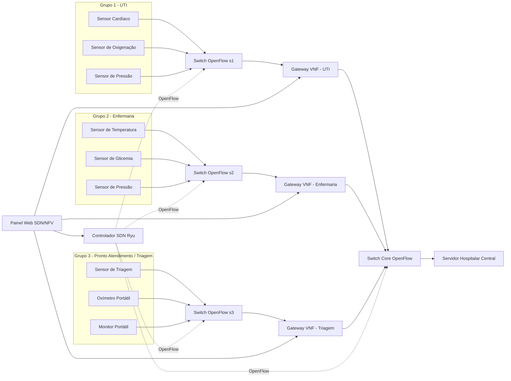
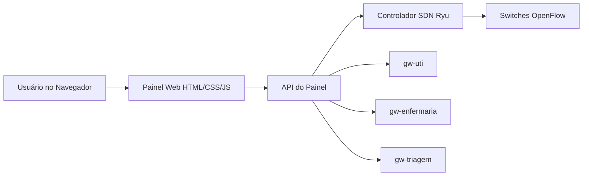

# Atividade 6 – Simulação + Relatório Técnico

## Tema do Projeto

**Rede hospitalar IoMT com SDN e NFV para controle de tráfego de sensores médicos**

Este projeto propõe a construção de um ambiente integrado para simular uma rede hospitalar baseada em dispositivos médicos conectados, também conhecida como **IoMT** (*Internet of Medical Things*). O ambiente utiliza **SDN** (*Software-Defined Networking*) para controle programável da rede, **NFV** (*Network Functions Virtualization*) para implementação de gateways virtualizados e **NS-3** para simulação e análise de desempenho.

A proposta consiste em representar três setores hospitalares distintos, cada um contendo sensores médicos que enviam dados para um servidor central. Antes de chegar ao servidor, todo tráfego deve passar obrigatoriamente por um gateway virtualizado específico do grupo. Esses gateways poderão aplicar funções de rede, como registro de logs, bloqueio de tráfego, limitação de banda e priorização.

---

## 1. Objetivo Geral

Projetar, implementar e validar um ambiente integrado contendo:

- SDN para controle programável dos switches OpenFlow;
- NFV com três gateways virtualizados;
- três grupos distintos de sensores médicos;
- um servidor hospitalar central;
- um painel web simples para configuração e visualização de políticas;
- simulação de desempenho no NS-3;
- comparação entre cenário normal e cenário com limitação aplicada a um gateway.

---

## 2. Contexto do Cenário

O cenário representa uma rede hospitalar na qual sensores médicos de diferentes setores enviam dados para um servidor central de monitoramento.

A aplicação prática do cenário envolve:

- monitoramento de pacientes em UTI;
- coleta de sinais vitais em enfermarias;
- triagem de pacientes no pronto atendimento;
- controle dinâmico do tráfego de rede;
- aplicação de políticas de segurança e desempenho;
- avaliação do impacto de limitação de banda em um grupo específico.

---

## 3. Grupos de Sensores

A atividade exige três grupos distintos de sensores, contendo no mínimo três sensores por grupo. Para o tema de saúde, os grupos serão organizados por setor hospitalar.

| Grupo | Setor Hospitalar | Sensores Simulados | Gateway VNF |
|---|---|---|---|
| Grupo 1 | UTI | Sensor cardíaco, sensor de oxigenação, sensor de pressão arterial | `gw-uti` |
| Grupo 2 | Enfermaria | Sensor de temperatura, sensor de glicemia, sensor de pressão arterial | `gw-enfermaria` |
| Grupo 3 | Pronto Atendimento/Triagem | Sensor de triagem, oxímetro portátil, monitor portátil | `gw-triagem` |

---

## 4. Componentes da Arquitetura

| Componente | Descrição | Tecnologia Sugerida |
|---|---|---|
| Sensores médicos | Simulam dispositivos IoMT enviando dados ao servidor | Python |
| Gateway VNF da UTI | Encaminha e registra tráfego crítico da UTI | Linux, `iptables`, `tc` |
| Gateway VNF da Enfermaria | Encaminha e pode limitar tráfego da enfermaria | Linux, `iptables`, `tc` |
| Gateway VNF da Triagem | Encaminha e pode bloquear tráfego da triagem | Linux, `iptables`, `tc` |
| Switches OpenFlow | Encaminham o tráfego sob controle SDN | Open vSwitch |
| Controlador SDN | Gerencia os switches e instala fluxos | Ryu |
| Servidor hospitalar central | Recebe dados dos sensores médicos | Python Flask ou servidor UDP |
| Painel web | Interface simples para visualização e aplicação de políticas | Flask/FastAPI + HTML/CSS/JS |
| NS-3 | Simulação lógica do cenário e coleta de métricas | NS-3 com FlowMonitor |
| Docker | Ambiente de execução e empacotamento dos serviços | Docker Compose |

---

## 5. Arquitetura Lógica



---

## 6. Regra Principal de Comunicação

Todo tráfego dos sensores deve passar pelo gateway correspondente antes de alcançar o servidor hospitalar central.

Regras lógicas:

```text
Sensores da UTI -> Gateway da UTI -> Servidor Hospitalar
Sensores da Enfermaria -> Gateway da Enfermaria -> Servidor Hospitalar
Sensores da Triagem -> Gateway da Triagem -> Servidor Hospitalar
```

Essa estrutura atende ao requisito obrigatório da atividade, que exige um gateway intermediário para cada grupo de sensores.

---

## 7. Endereçamento Sugerido

| Setor | Rede | Sensores | Gateway | Servidor |
|---|---|---|---|---|
| UTI | `10.0.1.0/24` | `10.0.1.11` a `10.0.1.13` | `10.0.1.1` | `10.0.100.10` |
| Enfermaria | `10.0.2.0/24` | `10.0.2.11` a `10.0.2.13` | `10.0.2.1` | `10.0.100.10` |
| Triagem | `10.0.3.0/24` | `10.0.3.11` a `10.0.3.13` | `10.0.3.1` | `10.0.100.10` |
| Servidor Central | `10.0.100.0/24` | — | — | `10.0.100.10` |

---

## 8. Implementação SDN

A camada SDN será responsável pelo controle programável dos switches OpenFlow.

### 8.1 Controlador SDN

O controlador sugerido é o **Ryu**, por ser simples, baseado em Python e adequado para atividades acadêmicas.

Funções previstas do controlador:

- detectar switches conectados;
- instalar fluxos OpenFlow;
- permitir comunicação entre sensores, gateways e servidor;
- apoiar a alteração dinâmica de comportamento da rede;
- integrar, se necessário, uma API REST para comunicação com o painel.

### 8.2 Switches OpenFlow

Os switches serão implementados com **Open vSwitch**.

Switches previstos:

| Switch | Função |
|---|---|
| `s1` | Conecta sensores da UTI ao gateway da UTI |
| `s2` | Conecta sensores da enfermaria ao gateway da enfermaria |
| `s3` | Conecta sensores da triagem ao gateway da triagem |
| `s4` ou `s-core` | Switch central que conecta gateways ao servidor |

### 8.3 Evidência de Fluxos

Durante a apresentação, os fluxos deverão ser exibidos com:

```bash
ovs-ofctl -O OpenFlow13 dump-flows s1
ovs-ofctl -O OpenFlow13 dump-flows s2
ovs-ofctl -O OpenFlow13 dump-flows s3
ovs-ofctl -O OpenFlow13 dump-flows s4
```

Esses comandos comprovam a instalação de fluxos OpenFlow nos switches.

---

## 9. Implementação NFV

A camada NFV será representada pelos três gateways virtualizados.

Cada gateway será responsável por processar o tráfego do seu respectivo grupo antes do envio ao servidor central.

---

### 9.1 Gateway da UTI — `gw-uti`

Função principal:

- encaminhar tráfego crítico;
- registrar logs;
- manter comunicação prioritária com o servidor.

Exemplo de regra:

```bash
iptables -I FORWARD -j LOG --log-prefix "GW_UTI_TRAFEGO: "
```

Possível interpretação:

> O tráfego da UTI é considerado crítico, portanto deve permanecer liberado e monitorado.

---

### 9.2 Gateway da Enfermaria — `gw-enfermaria`

Função principal:

- encaminhar tráfego da enfermaria;
- permitir aplicação de limitação de banda;
- servir como grupo principal para comparação de desempenho.

Exemplo de limitação:

```bash
tc qdisc add dev gw-enfermaria-eth1 root tbf rate 256kbit burst 32kbit latency 400ms
```

Possível interpretação:

> A enfermaria terá sua banda limitada para avaliar o impacto em métricas como vazão, atraso e perda de pacotes.

---

### 9.3 Gateway da Triagem — `gw-triagem`

Função principal:

- encaminhar tráfego da triagem;
- permitir bloqueio temporário para demonstração de política de segurança.

Exemplo de bloqueio:

```bash
iptables -A FORWARD -s 10.0.3.0/24 -d 10.0.100.10 -j DROP
```

Possível interpretação:

> O tráfego da triagem pode ser bloqueado temporariamente para simular uma política de contenção ou segurança.

---

## 10. Painel Simples para Configuração SDN/NFV

Além dos comandos via terminal, será criado um painel web simples para facilitar a demonstração e tornar a atividade mais visual.

O painel não configura diretamente os sensores. Ele envia comandos para:

- controlador SDN;
- gateways VNFs;
- ambiente Open vSwitch;
- scripts de limitação ou bloqueio.

---

### 10.1 Arquitetura do Painel



---

### 10.2 Funcionalidades do Painel

| Função | Descrição |
|---|---|
| Exibir status do controlador | Mostra se o controlador SDN está ativo |
| Exibir status dos gateways | Mostra se os gateways VNF estão operacionais |
| Exibir fluxos OpenFlow | Lista fluxos dos switches usando `ovs-ofctl dump-flows` |
| Limitar enfermaria | Aplica limitação de banda no gateway da enfermaria |
| Bloquear triagem | Aplica regra de bloqueio no gateway da triagem |
| Restaurar políticas | Remove bloqueios e limitações |
| Ver logs das VNFs | Exibe logs gerados pelos gateways |
| Mostrar sensores ativos | Lista sensores simulados por grupo |

---

### 10.3 Tela Sugerida do Painel

```text
+--------------------------------------------------+
| Painel SDN/NFV - Rede Hospitalar IoMT            |
+--------------------------------------------------+

[ Status do Controlador: ATIVO ]
[ Switches OpenFlow: 4 conectados ]
[ Gateways VNF: 3 ativos ]
[ Servidor Hospitalar: online ]

----------------------------------------------------

Grupo 1 - UTI
Status: liberado
Gateway: gw-uti
[ Ver fluxos ] [ Priorizar UTI ] [ Ver logs ]

Grupo 2 - Enfermaria
Status: normal
Gateway: gw-enfermaria
[ Limitar banda ] [ Remover limitação ] [ Ver logs ]

Grupo 3 - Triagem
Status: liberado
Gateway: gw-triagem
[ Bloquear tráfego ] [ Liberar tráfego ] [ Ver logs ]

----------------------------------------------------

Tabela de Fluxos OpenFlow
[ Atualizar fluxos ]

s1:
cookie=0x0, duration=..., table=0, priority=1, actions=...

s2:
cookie=0x0, duration=..., table=0, priority=1, actions=...
```

---

### 10.4 Endpoints Sugeridos para a API do Painel

| Método | Endpoint | Função |
|---|---|---|
| `GET` | `/status` | Retorna o status geral do ambiente |
| `GET` | `/switches` | Lista switches conectados |
| `GET` | `/flows/s1` | Lista fluxos do switch `s1` |
| `GET` | `/flows/s2` | Lista fluxos do switch `s2` |
| `GET` | `/flows/s3` | Lista fluxos do switch `s3` |
| `GET` | `/flows/s4` | Lista fluxos do switch core |
| `POST` | `/politicas/enfermaria/limitar` | Aplica limitação no gateway da enfermaria |
| `POST` | `/politicas/enfermaria/restaurar` | Remove limitação da enfermaria |
| `POST` | `/politicas/triagem/bloquear` | Bloqueia tráfego da triagem |
| `POST` | `/politicas/triagem/liberar` | Libera tráfego da triagem |
| `POST` | `/politicas/restaurar` | Restaura todas as políticas |
| `GET` | `/gateways/logs` | Exibe logs dos gateways |

---

## 11. Estrutura de Diretórios do Projeto

```text
atividade-6-sdn-nfv-saude/
│
├── docker-compose.yml
│
├── controller/
│   ├── Dockerfile
│   └── ryu_controller.py
│
├── topology/
│   ├── Dockerfile
│   └── hospital_topology.py
│
├── dashboard/
│   ├── Dockerfile
│   ├── app.py
│   ├── templates/
│   │   └── index.html
│   └── static/
│       ├── style.css
│       └── dashboard.js
│
├── vnf/
│   ├── gw_uti.sh
│   ├── gw_enfermaria.sh
│   ├── gw_triagem.sh
│   ├── limitar_enfermaria.sh
│   ├── bloquear_triagem.sh
│   └── restaurar_politicas.sh
│
├── apps/
│   ├── sensor_medico.py
│   └── servidor_hospitalar.py
│
├── ns3/
│   ├── hospital_iomt.cc
│   ├── resultados_normal.csv
│   └── resultados_limitado.csv
│
├── evidencias/
│   ├── dashboard.png
│   ├── dump-flows.png
│   ├── iptables.png
│   ├── tc-qdisc.png
│   └── ns3-resultados.png
│
└── relatorio/
    └── relatorio-tecnico.md
```

---

## 12. Organização dos Containers

| Container | Responsabilidade |
|---|---|
| `controller` | Executa o controlador Ryu |
| `topology` | Executa a topologia Mininet/Containernet com Open vSwitch |
| `dashboard` | Executa o painel web e sua API |
| `server` | Executa o servidor hospitalar central |
| `sensor-uti-1` | Simula sensor cardíaco |
| `sensor-uti-2` | Simula sensor de oxigenação |
| `sensor-uti-3` | Simula sensor de pressão |
| `sensor-enfermaria-1` | Simula sensor de temperatura |
| `sensor-enfermaria-2` | Simula sensor de glicemia |
| `sensor-enfermaria-3` | Simula sensor de pressão |
| `sensor-triagem-1` | Simula sensor de triagem |
| `sensor-triagem-2` | Simula oxímetro portátil |
| `sensor-triagem-3` | Simula monitor portátil |
| `gw-uti` | Gateway VNF da UTI |
| `gw-enfermaria` | Gateway VNF da enfermaria |
| `gw-triagem` | Gateway VNF da triagem |

> Observação: dependendo da abordagem escolhida, os sensores e gateways podem ser containers individuais ou hosts Docker controlados via Containernet.

---

## 13. Simulação no NS-3

A simulação no NS-3 deve representar o mesmo cenário lógico da implementação operacional.

Não é necessário reproduzir exatamente Docker, Ryu ou Open vSwitch dentro do NS-3. O objetivo é simular a lógica da rede:

```text
Sensores da UTI -> Gateway da UTI -> Servidor Hospitalar
Sensores da Enfermaria -> Gateway da Enfermaria -> Servidor Hospitalar
Sensores da Triagem -> Gateway da Triagem -> Servidor Hospitalar
```

---

### 13.1 Cenário Normal

No cenário normal:

- todos os sensores enviam dados ao servidor;
- todos os gateways operam sem limitação severa;
- as taxas de transmissão são equivalentes entre os grupos;
- o servidor recebe dados dos três setores hospitalares.

---

### 13.2 Cenário com Limitação

No cenário limitado:

- o gateway da enfermaria recebe uma limitação de banda;
- os sensores da enfermaria continuam comunicando com o servidor;
- a vazão da enfermaria deve diminuir;
- o atraso médio pode aumentar;
- a perda de pacotes pode aumentar;
- os demais grupos devem permanecer sem alteração significativa.

---

### 13.3 Métricas a Coletar

Embora a descrição da atividade mencione no mínimo duas métricas, os critérios de avaliação indicam a coleta de pelo menos três métricas reais. Portanto, recomenda-se coletar quatro métricas:

| Métrica | Objetivo |
|---|---|
| Throughput | Medir a vazão recebida pelo servidor |
| Delay médio | Medir o atraso médio dos pacotes |
| Packet loss | Medir a perda de pacotes |
| Jitter | Medir a variação do atraso |

---

### 13.4 Comparação Esperada

| Métrica | Cenário Normal | Cenário com Limitação na Enfermaria | Interpretação Esperada |
|---|---:|---:|---|
| Throughput da UTI | Alto | Alto | Não deve ser afetado |
| Throughput da Enfermaria | Alto | Reduzido | Deve cair devido à limitação |
| Throughput da Triagem | Alto | Alto | Não deve ser afetado |
| Delay da UTI | Baixo | Baixo | Não deve sofrer impacto |
| Delay da Enfermaria | Baixo | Maior | Deve aumentar pela limitação |
| Delay da Triagem | Baixo | Baixo | Não deve sofrer impacto |
| Packet loss da Enfermaria | Baixo | Maior | Pode aumentar em caso de congestionamento |
| Jitter da Enfermaria | Baixo | Maior | Pode aumentar com variação de atraso |

---

## 14. Roteiro da Demonstração Operacional

A demonstração ao vivo deve provar que o ambiente está funcionando.

---

### 14.1 Subir o Ambiente

```bash
docker compose up -d
```

Verificar containers:

```bash
docker compose ps
```

---

### 14.2 Mostrar o Controlador SDN

```bash
docker logs controller
```

Explicação esperada:

> O controlador SDN está ativo e conectado aos switches OpenFlow.

---

### 14.3 Mostrar Switches e Fluxos

```bash
ovs-vsctl show
ovs-ofctl -O OpenFlow13 dump-flows s1
ovs-ofctl -O OpenFlow13 dump-flows s2
ovs-ofctl -O OpenFlow13 dump-flows s3
ovs-ofctl -O OpenFlow13 dump-flows s4
```

Explicação esperada:

> As tabelas de fluxo comprovam que o controlador instalou regras nos switches OpenFlow.

---

### 14.4 Mostrar Comunicação dos Sensores

Executar sensores simulados:

```bash
python apps/sensor_medico.py --grupo uti
python apps/sensor_medico.py --grupo enfermaria
python apps/sensor_medico.py --grupo triagem
```

Exemplo de logs no servidor:

```text
[HOSPITAL] UTI - batimento=82 oxigenacao=97 pressao=120/80
[HOSPITAL] ENFERMARIA - temperatura=36.8 glicemia=95 pressao=118/76
[HOSPITAL] TRIAGEM - oxigenacao=98 prioridade=normal
```

---

### 14.5 Mostrar Funcionamento das VNFs

Listar regras dos gateways:

```bash
iptables -L -v -n
tc qdisc show
```

Explicação esperada:

> As VNFs estão aplicando funções de rede, como log, bloqueio ou limitação de banda.

---

### 14.6 Aplicar Limitação na Enfermaria

Via painel:

```text
Botão: Limitar Enfermaria
```

Ou via terminal:

```bash
./vnf/limitar_enfermaria.sh
```

Comando base:

```bash
tc qdisc add dev gw-enfermaria-eth1 root tbf rate 256kbit burst 32kbit latency 400ms
```

---

### 14.7 Bloquear Triagem

Via painel:

```text
Botão: Bloquear Triagem
```

Ou via terminal:

```bash
./vnf/bloquear_triagem.sh
```

Comando base:

```bash
iptables -A FORWARD -s 10.0.3.0/24 -d 10.0.100.10 -j DROP
```

---

### 14.8 Restaurar Políticas

Via painel:

```text
Botão: Restaurar Políticas
```

Ou via terminal:

```bash
./vnf/restaurar_politicas.sh
```

---

## 15. Evidências para Coletar

Durante o desenvolvimento e a apresentação, recomenda-se salvar evidências para o relatório.

| Evidência | Comando ou Origem |
|---|---|
| Containers ativos | `docker compose ps` |
| Controlador ativo | `docker logs controller` |
| Switches conectados | `ovs-vsctl show` |
| Fluxos instalados | `ovs-ofctl -O OpenFlow13 dump-flows s1` |
| Regras de firewall | `iptables -L -v -n` |
| Regras de limitação | `tc qdisc show` |
| Comunicação sensores-servidor | logs do servidor |
| Painel funcionando | print da tela |
| NS-3 cenário normal | arquivo de resultados |
| NS-3 cenário limitado | arquivo de resultados |
| Gráfico comparativo | imagem ou tabela gerada a partir dos resultados |

---

## 16. Estrutura do Relatório Técnico

O relatório deve ter entre 5 e 7 páginas.

Sugestão de estrutura:

```text
1. Introdução
2. Descrição do cenário
3. Arquitetura proposta
4. Implementação SDN
5. Implementação NFV
6. Painel de configuração
7. Simulação no NS-3
8. Resultados comparativos
9. Análise técnica
10. Conclusão
```

---

### 16.1 Introdução

Apresentar o objetivo da atividade e contextualizar o uso de SDN, NFV e simulação em uma rede hospitalar IoMT.

---

### 16.2 Descrição do Cenário

Descrever os três setores hospitalares:

- UTI;
- enfermaria;
- pronto atendimento/triagem.

Explicar o papel dos sensores, gateways e servidor central.

---

### 16.3 Arquitetura Proposta

Incluir:

- diagrama da topologia;
- tabela de componentes;
- endereçamento;
- fluxo obrigatório passando pelos gateways;
- papel do controlador SDN.

---

### 16.4 Implementação SDN

Explicar:

- controlador Ryu;
- switches OpenFlow;
- instalação de fluxos;
- comandos de validação;
- evidências com `ovs-ofctl dump-flows`.

---

### 16.5 Implementação NFV

Explicar:

- gateway da UTI;
- gateway da enfermaria;
- gateway da triagem;
- uso de `iptables`;
- uso de `tc`;
- alteração dinâmica de comportamento.

---

### 16.6 Painel de Configuração

Explicar:

- objetivo do painel;
- funcionalidades;
- integração com controlador e gateways;
- botões de bloqueio, limitação e restauração;
- uso do painel na demonstração.

---

### 16.7 Simulação NS-3

Explicar:

- cenário normal;
- cenário limitado;
- métricas coletadas;
- lógica da comparação;
- ferramentas utilizadas para coleta de dados.

---

### 16.8 Resultados Comparativos

Apresentar tabela com resultados obtidos:

| Métrica | Normal | Limitado | Variação |
|---|---:|---:|---:|
| Throughput Enfermaria | A preencher | A preencher | A preencher |
| Delay Enfermaria | A preencher | A preencher | A preencher |
| Packet Loss Enfermaria | A preencher | A preencher | A preencher |
| Jitter Enfermaria | A preencher | A preencher | A preencher |

---

### 16.9 Análise Técnica

Analisar:

- impacto da limitação no gateway da enfermaria;
- comportamento dos demais grupos;
- papel da SDN no controle da rede;
- papel da NFV na aplicação das políticas;
- coerência entre ambiente operacional e simulação.

---

### 16.10 Conclusão

Concluir destacando:

- atendimento aos requisitos da atividade;
- funcionamento integrado de SDN, NFV e NS-3;
- importância do controle programável em redes hospitalares;
- limitações do ambiente;
- possíveis melhorias futuras.

---

## 17. Critérios de Avaliação e Como Atender

| Critério | Peso | Como atender |
|---|---:|---|
| Integração funcional do ambiente | 30% | Implementar 3 grupos, 3 gateways, controlador, switches e servidor |
| Validação técnica operacional | 25% | Demonstrar fluxos, VNFs, logs, bloqueios e comandos |
| Simulação e métricas no NS-3 | 20% | Coletar throughput, delay, packet loss e jitter |
| Operação e diagnóstico | 15% | Explicar comandos e corrigir falhas durante apresentação |
| Organização técnica e relatório | 10% | Entregar relatório claro, com diagramas e evidências |

---

## 18. MVP do Projeto

O mínimo viável para garantir a entrega deve conter:

- 9 sensores simulados;
- 3 grupos de sensores;
- 3 gateways VNFs;
- 1 servidor hospitalar;
- 1 controlador SDN;
- switches OpenFlow;
- comunicação entre sensores e servidor;
- tráfego passando pelos gateways;
- comando `ovs-ofctl dump-flows`;
- comando `iptables -L -v -n`;
- comando `tc qdisc show`;
- alteração de comportamento em pelo menos um grupo;
- simulação NS-3 com cenário normal e cenário limitado;
- coleta de pelo menos 3 métricas;
- relatório técnico de 5 a 7 páginas.

---

## 19. Ordem Recomendada de Desenvolvimento

1. Definir a topologia lógica da rede hospitalar.
2. Criar a estrutura inicial de diretórios.
3. Configurar Docker Compose.
4. Subir controlador Ryu.
5. Criar topologia com switches OpenFlow.
6. Criar sensores simulados.
7. Criar servidor hospitalar central.
8. Criar gateways VNFs.
9. Garantir que todo tráfego passe pelo gateway correto.
10. Validar comunicação sensores-servidor.
11. Exibir fluxos com `ovs-ofctl dump-flows`.
12. Implementar regras `iptables`.
13. Implementar limitação com `tc`.
14. Criar painel web simples.
15. Integrar painel com comandos e políticas.
16. Criar simulação NS-3.
17. Coletar métricas.
18. Comparar cenário normal e limitado.
19. Gerar tabelas e gráficos.
20. Montar relatório técnico.

---

## 20. Decisão Técnica Recomendada

Para facilitar a apresentação, recomenda-se que a principal alteração de comportamento seja:

> **Limitação de banda no gateway da enfermaria.**

Justificativa:

- é fácil de demonstrar;
- afeta diretamente métricas como throughput, delay e packet loss;
- permite comparação clara no NS-3;
- não interrompe totalmente a comunicação;
- mantém o sistema funcionando durante a apresentação.

O bloqueio da triagem pode ser usado como funcionalidade adicional, mas a limitação da enfermaria deve ser o foco principal da análise comparativa.

---

## 21. Resumo Final da Proposta

O projeto será baseado em uma rede hospitalar IoMT com três setores: UTI, enfermaria e triagem. Cada setor terá três sensores médicos que enviam dados para um servidor hospitalar central. O tráfego de cada grupo passará obrigatoriamente por um gateway VNF específico.

A rede será controlada por SDN, usando um controlador Ryu e switches OpenFlow. As VNFs serão implementadas nos gateways com regras de `iptables` e `tc`. Um painel web simples permitirá visualizar o status do ambiente, consultar fluxos OpenFlow e aplicar políticas como limitação de banda ou bloqueio de tráfego.

A simulação no NS-3 representará o mesmo cenário lógico e comparará dois casos: operação normal e operação com limitação aplicada ao gateway da enfermaria. As métricas coletadas serão throughput, delay, packet loss e, se possível, jitter.

Essa estrutura atende aos requisitos técnicos da atividade e oferece uma demonstração clara da integração entre SDN, NFV e simulação de desempenho.
